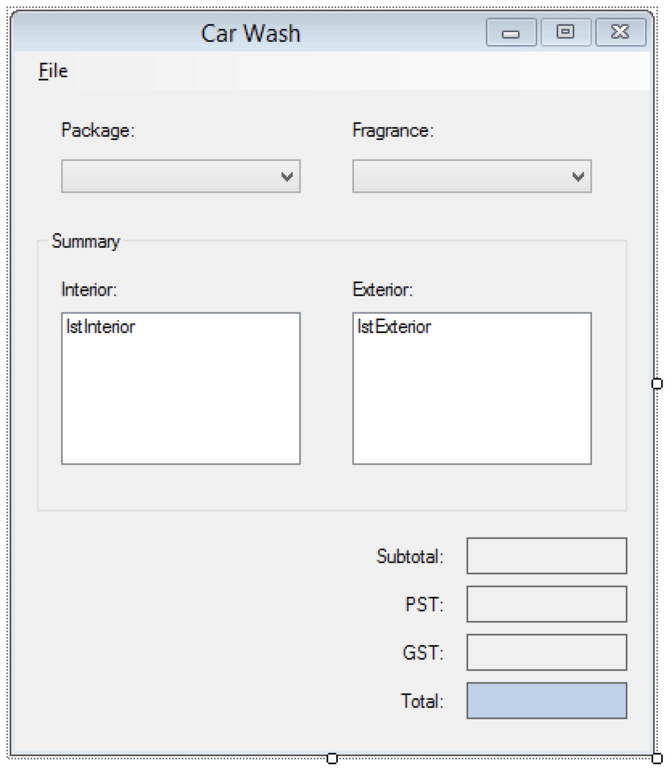
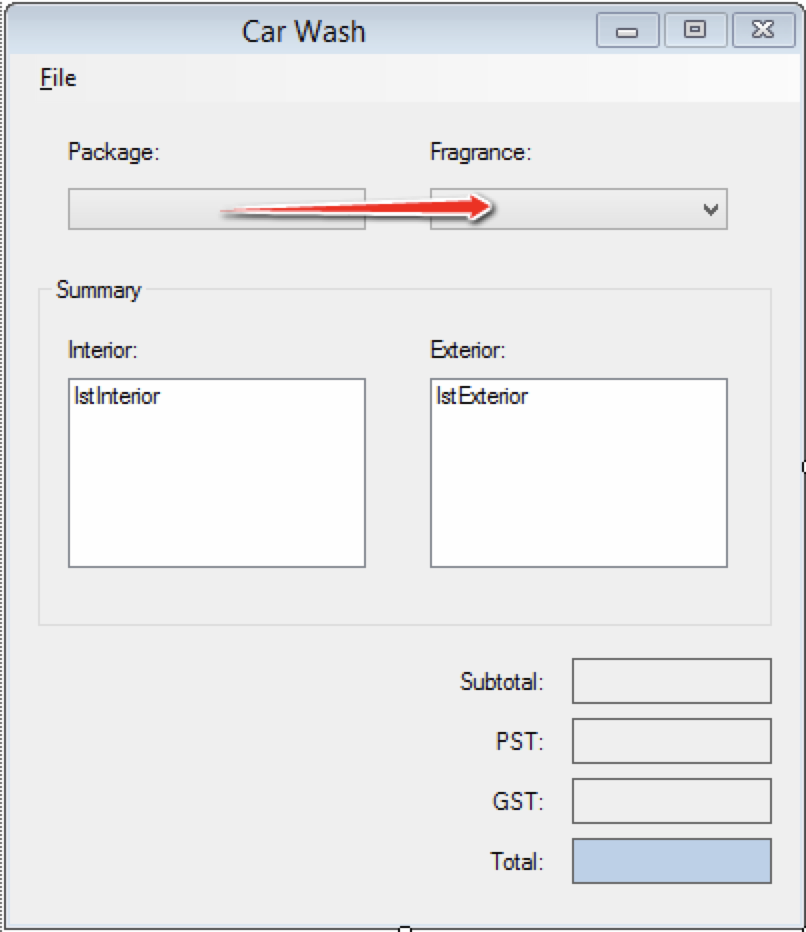
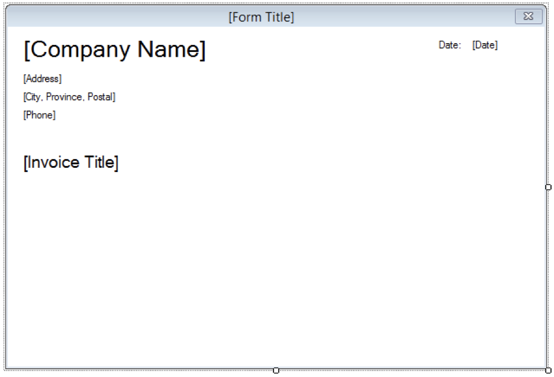
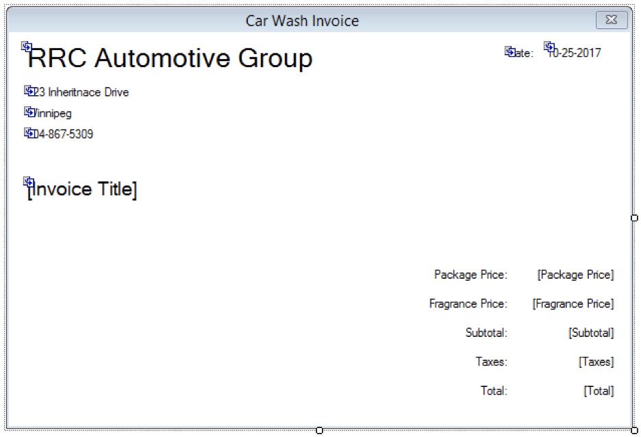
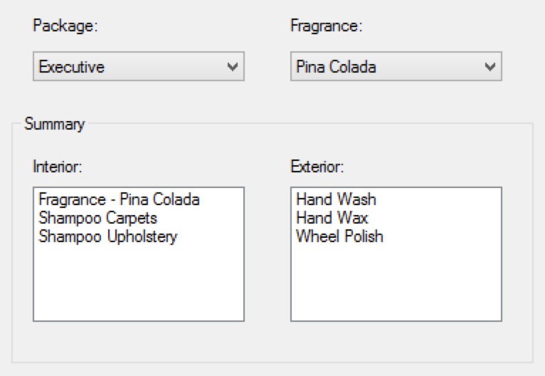
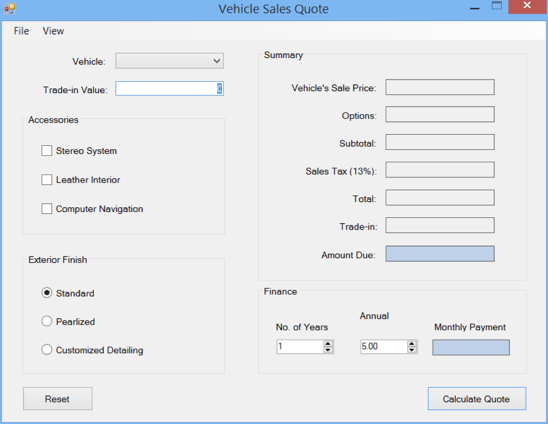
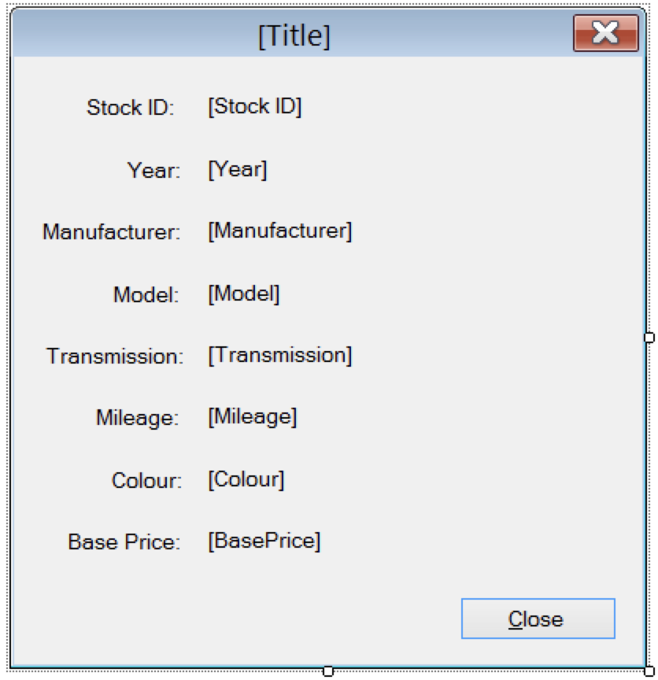

## Vehicle Trade Project
> #### Description:
>
> **The name of this application Vehicle Trade. The purpose of this application is to make it easier and faster for people to calculate the price of a car according to their own preferences when buying a car. They can choose either the ’Sales Quote’ or ‘Car wash’ tab. Users can also go through the input fields by using the tab key. When the user enters the wrong characters, the error warnings will show up on the right side of the input field. When the users select ‘Sales Quote’, they can choose the accessories, exterior finish and annual interest rate, and the number of years. The calculator will automatically adjust the tax, subtotal, and so on based on their choice.**
>
>**When the users select ‘Car Wash’, they can choose the interior and exterior accessories they want and the system will finally populate an Invoice based on the accessories they choose.**

### Introduction
> This phase of the project will have modify the sales quote form and begin development on the car wash portion of the application.

### Requirements
#### Provided Library
> A class library (and documentation) is provided to you to complete the functionality of the sales quote form. Download the .dll and documentation here.

> * ***DataRetriever. GetVehicles()***

### Car Wash Entry Form
#### Programming Requirements
> The functionality of this form must be written in a way that allows for changes to the data without having to update the code that uses the data. Use collections to store program data. The collections will be used to populate UI controls.

> The list controls on the form must be populated with data in code; do not use designer. Add data to the controls in the specified order as outlined above. Feel free to create your own class(es) or structure(s) for storing data.

> Design the car wash entry form to match the following design:

> **Note:** The image above does not reflect the initial state requirements below.

##### Initial State
> **The form will have the following initial state:**
> * The form has no icon.
> * The title of the form is “Car Wash”.
> * The form cannot be maximized.
> * The form (window) cannot be resized by the user.  (FormBorderStyle)
> * The Generate Invoice menu strip item is disabled (see Menu Strip section).
> * The Package and Fragrance ComboBoxes are populated with the specified values (see Packages and Prices & Fragrances and Prices sections). Text cannot be entered into these controls.
> * No Package is selected.
> * The selected fragrance is Pine.
> * The ListBox controls in the Summary Group Box are empty.
> * The Subtotal, Taxes and Total output labels are blank. The alignment of text in these labels is to the right and centered vertically.
> * The Labels are formatted as:
>   * Subtotal: Currency
>   * PST: Number to two decimal places
>   * GST: Number to two decimal places
>   * Total: Currency

#### Tab Order

#### Invoice Base Form
> **Design the base invoice form:**

> **Note:** The image above does not reflect the initial state requirements below.
>
> #### Initial State
> The form will have the following initial state:
> * The form has no icon.
> * The title of the form is “[Form Title]”.
> * The background of the form is white.
> * The labels are populated with the following formation. Note: each line of text is its own Label control.
>   * Company Name: RRC Automotive Group
>   * Address: 777 Inheritance Drive
>   * City: Winnipeg
>   * Province: Manitoba
>   * Postal Code: I0I 0I0
>   * Phone: 204-867-5309
> * The current date formatted as month-day-year.
> The invoice title set to “[Invoice title]”.

### Car Wash Invoice Form
> **Design the car wash invoice form:**

> **Note:** The image above does not reflect the initial state requirements below.
> ##### Initial State
> **The form will have the following initial state:**
> * The title of the form is “Car Wash Invoice”.
> * The invoice title set to “Car Wash Invoice”.
> * The Car Wash Invoice information displayed and formatted as:
>   * Package Price: Currency
>   * Fragrance Price: Number
>   * Subtotal: Currency
>   * Taxes: Number
>   * Total: Currency

### Car Wash Entry Form Functionality
> When a customer makes an appointment for a car wash service, the Car Wash form is used for determining payment and invoicing. The form has two inputs;

### Package and Fragrance.
> The package the customer chooses will be selected using the ComboBox control labelled Package. The selected package determines the interior and exterior services performed during the car wash. The interior and exterior services are listed in the summary ListBox controls.

> An interior odour replacement service is provided with each car wash. The complimentary fragrance for the odour replacement is Pine. A customer may choose another fragrance, which may have a cost associated with it. The fragrance the customer chooses will be selected using the Fragrance ComboBox control. The fragrance selected will also be updated in the summary’s interior ListBox.

> When both the Package and Fragrance has been selected, the charges for the car wash are updated on the form.

### Package ComboBox
> **When an item is selected in this control, the following must happen:**
> * Update the Summary section ListBoxes. The tables below outline the items to be included in the ListBoxes for each package selection.
> * Update the subtotal, tax (GST and PST) and total output labels on the form.

### Interior Services by Package
| Description | Standard | Deluxe | Executive | Luxury |
|------------:|:-------:|:-------:|:----------:|:-----:|
|Fragrance - [selected_fragrance_text]|X|X|X|X|
|Shampoo Carpets| |X|X|X|
|Shampoo Upholstery| | |X|X|
|Interior Protection Coat| | | | X|

### Exterior Services by Package
| Description | Standard | Deluxe | Executive | Luxury |
|------------:|:-------:|:-------:|:----------:|:-----:|
|Hand Wash|X|X|X|X|
|Hand Wax| |X|X|X|
|Wheel Polish | ||X|X|
|Detail Engine Compartment| | | | X|

### Package and Fragrance Prices
#### **Packages**

| Description | Price |
|------------:|:-------:|
|Standard|$7.50|
|Deluxe|$15.00|
|Executive|$35.00|
|Luxury|$55.00|

#### **Fragrances**

| Description | Price |
|------------:|:-------:|
|Hawaiian Mist|$2.75|
|Baby Powder|$1.50|
|Pine|$0.00|
|Country Floral|$2.25|
|Pina Colada|$0.75|
|Vanilla|$2.00|
|||

##### **Sample Output**

### Menu Strip
> The form’s menu strip will have the following structure:
> * File
>   * Generate Invoice… (Ctrl+Shift+I)
>   * [Separator Bar]
>   * Exit (Alt+F4)
>
> **Note:** The menu strip items must be named correctly, include keyboard accessors and keyboard shortcuts as outlined (in parentheses) above.
>
> The Generate Invoice menu item is enabled when a Car Wash Invoice is created.
>
> When the Generate Invoice menu item is clicked, an instance of the car wash invoice form will appear displaying data from the entry form. The invoice form will be opened as a modal window.
> When the invoice form is closed, the Car Wash Entry form will be reset back to its initial state.

### Exit Menu Item
> When the Exit menu item is clicked, the form will close.

### Invoice Base Form
> The base invoice form is the base class for all invoice forms. The base invoice class will populate the company information along with the current date.

### Car Wash Invoice Form
> The car wash invoice form derives from the base invoice form. The car wash form will display information about a car wash invoice.

### Sales Quote Form

> **Update the form design with the following changes:**
> * Add a MenuStrip control to the form (design requirements below).
> * The Label used to describe the Vehicle’s Sale Price TextBox has updated text.
> * The Vehicle’s Sales Price TextBox is removed and replaced by a ComboBox.

### Initial State Changes
> * ComboBox populated with Vehicle data. Only the Vehicle’s Stock ID will be displayed in the ComboBox control. Initially no item is selected.
> * Vehicle Information menu item is disabled.

### Sales Quote Form Functionality
> The previous functionality of the form should not be affected by these changes.

### Menu Strip Design and Functionality
> **The form’s menu strip will have the following structure:**
> * File
>   * Close (Ctrl+W)
> * View
>   * Vehicle Information… (Ctrl+Shift+I)

> **Note:** The menu strip items must be named correctly, include keyboard accessors and keyboard shortcuts as outlined (in parentheses) above.

> **Close Menu Item**
>
> When the Close menu item is clicked, the form will close.

> **Vehicle Information Menu Item**
>
> The Vehicle Information menu item is only enabled when a vehicle is selected.
When the Vehicle Information menu item is clicked, an instance of the Vehicle Information form is displayed to the user showing vehicle information for the selected vehicle. The Vehicle Information form is open as a modal form.

> **Vehicle ComboBox**
>
> When a quote has been created and a different vehicle is selected from the ComboBox, clear the summary and monthly payment output Labels.

> **Calculate Quote Button**
>
> When the Calculate Quote button is clicked and a vehicle is not selected, display an error icon beside the ComboBox with the error message “A vehicle must be selected.” Otherwise, the previous functionality is the same.

### Vehicle Information Form

#### **Initial State**
> * The caption of the form includes the vehicle’s stock id, year, manufacturer and model in the following format: {stock_id} - {year} {manufacturer} {model}
> * The output Labels are bound to display the selected vehicle’s information.

### Vehicle Information Form Functionality
> When the form appears, the information for the selected Vehicle in the Sales Quote form will be displayed in the output Labels. Output Formatting:
> * Mileage: Format as number with no decimal places.
> * Base Price: Format as currency.

### Transmission Output
> The output for transmission is either “Automatic” or “Manual” depending on the value of the state of the Vehicle object.

> **Close Button**
>
> When the user clicks the Close button the Vehicle Information form will close.

### Programming Requirements
> * Your program must use data binding to populate controls. In some special cases, data binding may not make sense, and thus output will be generated another way.
> * Your program must use the provided .dll to generate the Vehicle data.

### Testing
> Ensure the application is fully tested before user acceptance testing (UAT). Developing a list of test cases prior to testing will help eliminate missing tests.

